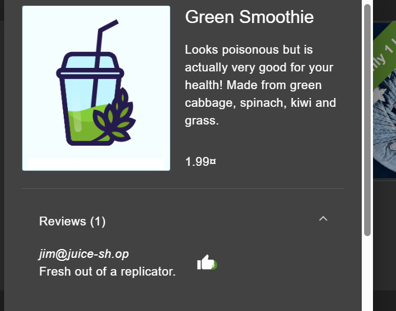
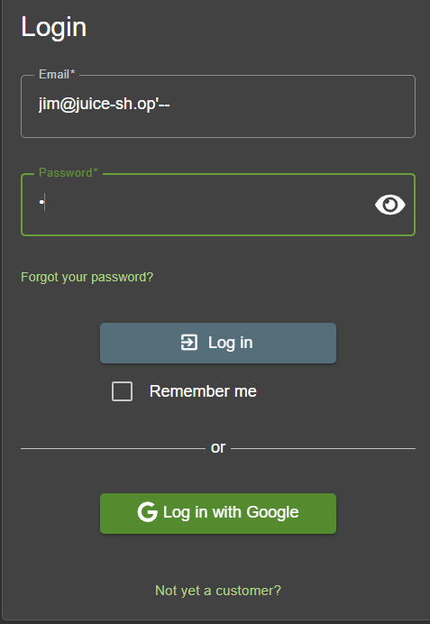
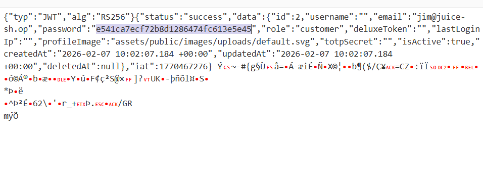
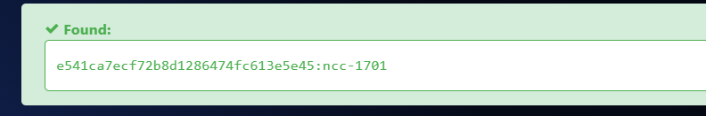
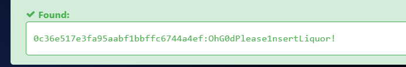
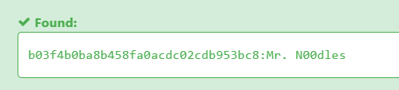
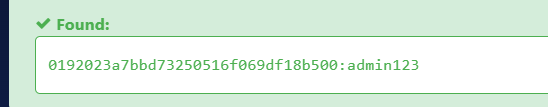
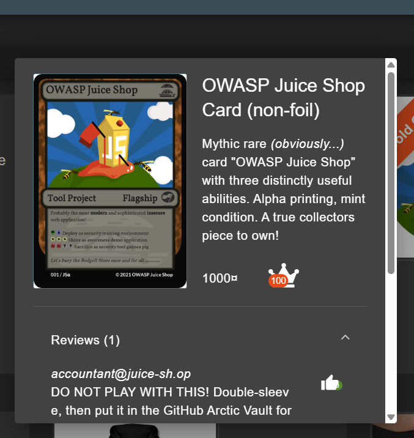
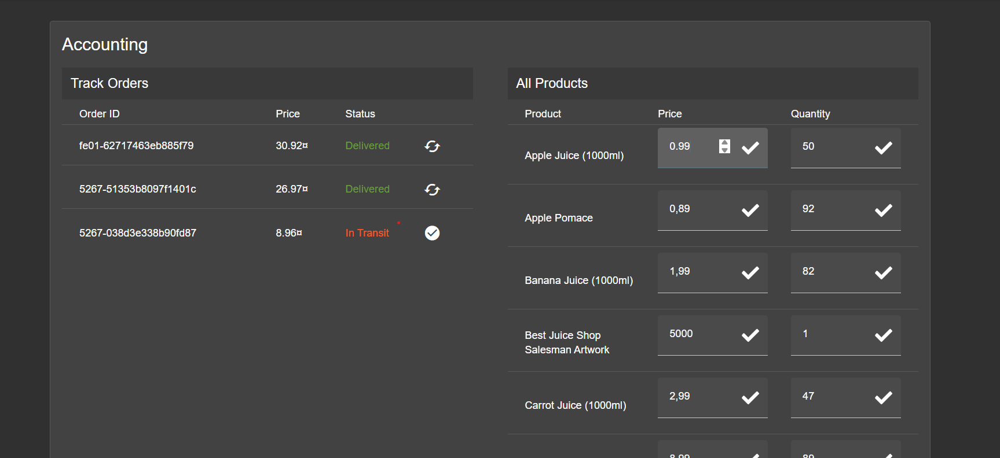
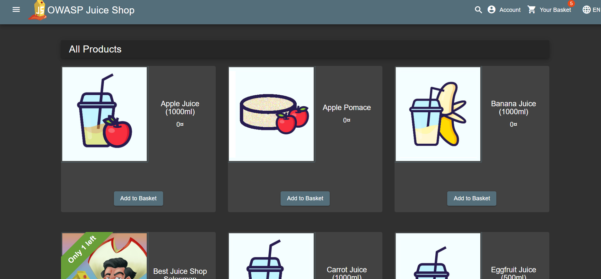

# Password cracking + price manipulation

As now i am in hold of knowledge that sql injection is working i can see what type of token other accounts have. I look for every email i could find in reviews on the site. For example.

jim@juice-sh.op is the next email i could find

I used the same sql injection trick as before to get inside his account

As i am now capable of looking for information about Jim i am scrolling through his account for something interesting. Unfortunately this time only thing i found are normal reviews under products. Now i tried to see more information about stan's account. In order to do that i copied his token and decode it from base64 using CyberChef. Here are results.

Info i found: Jim's ID - 2, hash_of_password - e541ca7ecf72b8d1286474fc613e5e45 

Thats a good info. Now i tried to crack Jim's password. With usage of hashes.com i am able to do it without a problem. 

Jim's password is ncc-1701

Now i was looking for other interesting accounts and passwords that was connected to them. 

I Stumbled upon several accounts that some couldnt crack so easily with hashes.com or even hashcat. Examples of password i found:

# Price manipulation

One of the core function of a site is "buying products". The prices varies a lot. From 0.99 to 9999 currency of OWASP Juice Shop. However one of the account have the ability to change all of the prices.

I stumbled around accountant account. After using sql injection i saw that there is "Accounting" function connected to the profile. If we go inside we can see that the user now have ability to change every price in the shop.

Now i changed everything so it costs 0 value of currency.

We can buy everything for 0 value of currency.

