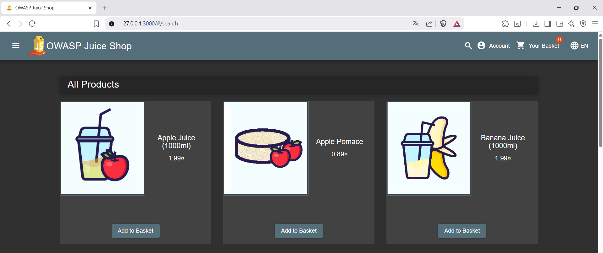
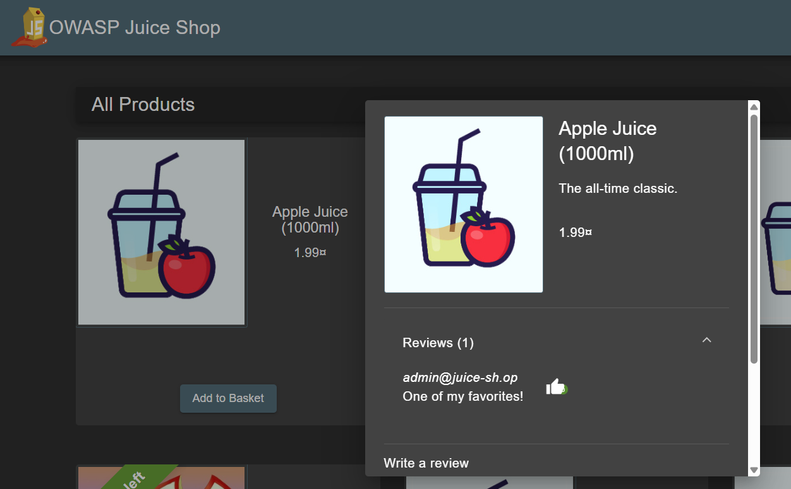
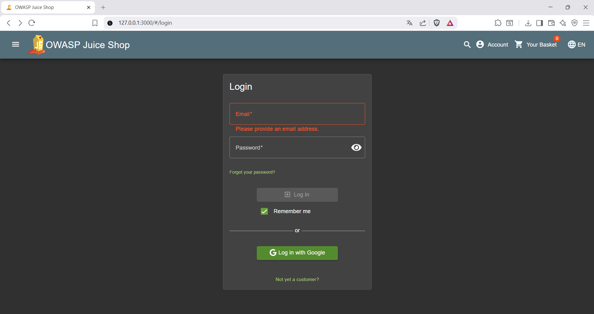
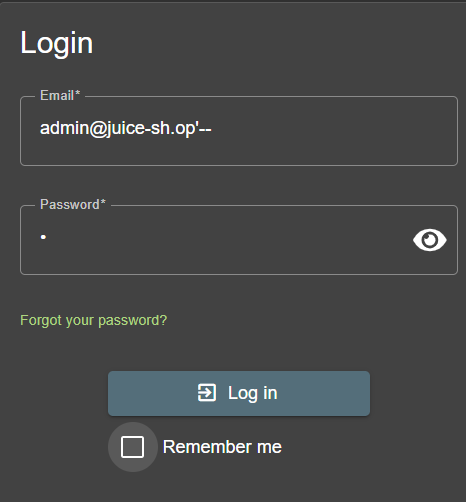
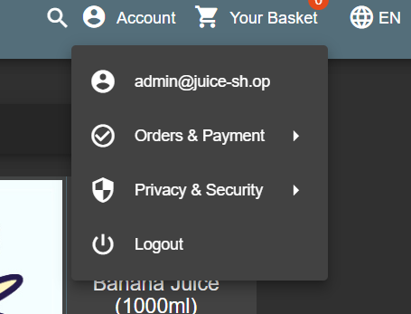

# Admin account takeover via SQL Injection 

## Description
The goal was simple, get access to admin's account withoute knowing the passoword and by using sql injection. First i needed to know what kind of email address was used by admin. 

## Basic look of a site

There are plenty of things that are "possible to buy" on the site. Investigating further you can go into specifc item and see if any of the materials have review pinned to them. In the first item there is a signle review with email connected to it:

## First item review

After this step i can clearly see what emailm is admin's. 
admin@juice-sh.op
Now i went to login page

It's a simple login form. I tried using sql injection. Sql injection is vulnerability where an application confuses user input with database instructions. By entering specific characters into a form, attacker tricks the system into executing their text as a command rather than simply storing it as data. 

The basic application code looks like this

## SELECT * FROM Users WHERE email = '$email' and password = '&password';

However if we would put our login (email) like this:

we would get diffrent result of sql queries

## SELECT * FROM Users Where email = 'admin@juice-sh.op'-- AND password = '*';

After "--" characters, commenting starts. So what happends next is that program passes the password as its commented out. We get into admin's account withoute knowing the password

